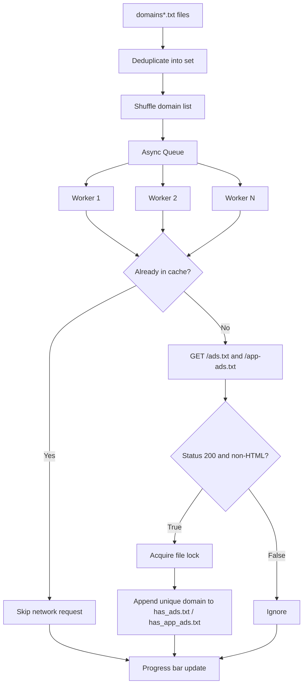

<div align="left">

<pre>
     _       _      _        _      ___        _                                _      _        _   
    / \   __| |___ | |___  _| |_   ( _ )      / \   _ __  _ __         __ _  __| |___ | |___  _| |_ 
   / _ \ / _` / __|| __\ \/ / __|  / _ \/\   / _ \ | '_ \| '_ \ _____ / _` |/ _` / __|| __\ \/ / __|
  / ___ \ (_| \__ \| |_ >  <| |_  | (_>  <  / ___ \| |_) | |_) |_____| (_| | (_| \__ \| |_ >  <| |_ 
 /_/   \_\__,_|___(_)__/_/\_\\__|  \___/\/ /_/   \_\ .__/| .__/       \__,_|\__,_|___(_)__/_/\_\\__|
                                                   |_|   |_|                                        
     _                            ____ _               _             
    / \   ___ _   _ _ __   ___   / ___| |__   ___  ___| | _____ _ __ 
   / _ \ / __| | | | '_ \ / __| | |   | '_ \ / _ \/ __| |/ / _ \ '__|
  / ___ \\__ \ |_| | | | | (__  | |___| | | |  __/ (__|   <  __/ |   
 /_/   \_\___/\__, |_| |_|\___|  \____|_| |_|\___|\___|_|\_\___|_|   
              |___/                                
</pre>

</div>

**Ads.txt & App-ads.txt Async Checker:** A high-throughput asynchronous Python crawler for validating `ads.txt` and `app-ads.txt` availability across massive domain inventories.

[](https://gist.github.com/OstinUA/7d82c337e3402ec9771d3ed23fab64cb)

[](https://www.python.org/)
[](https://docs.python.org/3/library/asyncio.html)
[](https://docs.aiohttp.org/)
[](LICENSE)

> [!NOTE]
> This project is implemented as an asynchronous crawler script (not a packaged Python library), optimized for large-scale domain checks with resumable output files.

## Table of Contents

- [Title and Description](#adstxt--app-adstxt-async-checker)
- [Table of Contents](#table-of-contents)
- [Features](#features)
- [Tech Stack & Architecture](#tech-stack--architecture)
  - [Core Stack](#core-stack)
  - [Project Structure](#project-structure)
  - [Key Design Decisions](#key-design-decisions)
- [Getting Started](#getting-started)
  - [Prerequisites](#prerequisites)
  - [Installation](#installation)
- [Testing](#testing)
- [Deployment](#deployment)
- [Usage](#usage)
- [Configuration](#configuration)
- [License](#license)
- [Contacts & Community Support](#contacts--community-support)

## Features

- Asynchronous HTTP crawling powered by `asyncio` + `aiohttp` for high concurrency.
- Parallel checks for both compliance endpoints:
  - `https://<domain>/ads.txt`
  - `https://<domain>/app-ads.txt`
- Multi-file input ingestion via `domains*.txt` glob pattern.
- Automatic cross-file deduplication using in-memory `set` semantics.
- Resumable workflow with incremental persistence to:
  - `has_ads.txt`
  - `has_app_ads.txt`
- Idempotent writes: previously discovered domains are not duplicated.
- Randomized domain scheduling to reduce sequential infrastructure bias.
- Progress telemetry with `tqdm` (`Progress` bar by domain count).
- Strict timeout-based request control (`TIMEOUT_SECONDS`).
- Redirect-aware requests (`allow_redirects=True`).
- Lightweight content-type validation (`200 OK` and not `text/html`).
- Silent exception handling for noisy network failures (DNS/TLS/transient).
- Windows event loop policy compatibility fix for stable execution.

> [!IMPORTANT]
> The crawler intentionally suppresses many runtime warnings and request exceptions to maximize throughput and keep stdout clean. If you need debugging visibility, run a fork with explicit exception logging.

## Tech Stack & Architecture

### Core Stack

- **Language:** Python `3.8+`
- **Async Runtime:** `asyncio`
- **HTTP Client:** `aiohttp`
- **CLI Progress:** `tqdm`
- **Standard Lib Modules:** `glob`, `os`, `random`, `time`, `warnings`, `logging`, `sys`

### Project Structure

```text
.
├── adstxtcrawler.py       # Main asynchronous crawler implementation
├── README.md              # English project documentation
├── README_ru.md           # Russian project documentation
└── LICENSE                # Open-source license file
```

### Key Design Decisions

- **Queue + worker model:** The script pushes normalized domains into an `asyncio.Queue` and consumes them with fixed worker concurrency.
- **Lock-protected writes:** An `asyncio.Lock` serializes output file writes to avoid interleaving or race conditions across workers.
- **Persistent caching by file:** Existing output files are loaded at startup and used as an execution cache to skip already verified domains.
- **Best-effort networking strategy:** Exceptions are swallowed, making this a throughput-first crawler suitable for noisy internet-scale datasets.

<details>
<summary>Mermaid: runtime data flow</summary>



</details>

## Getting Started

### Prerequisites

- Python `3.8` or newer
- Network egress to target domains (HTTPS/443)
- Input files named with pattern `domains*.txt`

> [!TIP]
> Use Python virtual environments to isolate dependencies and avoid polluting your system interpreter.

### Installation

```bash
git clone https://github.com/<your-org>/<your-repo>.git
cd AdVerify-adstxt-appadstxt-Crawler
python -m venv .venv
source .venv/bin/activate  # Linux/macOS
# .venv\Scripts\activate   # Windows PowerShell
pip install --upgrade pip
pip install aiohttp tqdm
```

Create one or more domain input files:

```text
domains.txt
domains_batch_01.txt
domains_partners.txt
```

Each file should contain one domain per line (with or without scheme).

<details>
<summary>Troubleshooting and alternative setup paths</summary>

### Common issues

- **`No files found matching the pattern domains*.txt`**
  - Ensure your files start with `domains` and end with `.txt`.
  - Ensure you are running from the repository root.

- **TLS/SSL-related failures**
  - The script calls `ssl=False`, but upstream/network middleware can still interfere.
  - Validate outbound firewall/proxy constraints.

- **Slow or inconsistent throughput**
  - Reduce `CONCURRENCY_LIMIT` when network or resolver saturation occurs.
  - Tune `TIMEOUT_SECONDS` for your environment.

### Build-from-source style install (offline wheel cache)

```bash
pip download aiohttp tqdm -d ./vendor
pip install --no-index --find-links=./vendor aiohttp tqdm
```

</details>

## Testing

This repository does not currently ship a formal unit/integration test suite. You can still run baseline checks:

```bash
python -m py_compile adstxtcrawler.py
python -m pip check
```

Recommended quality gates if you extend the project:

```bash
python -m pytest -q
python -m ruff check .
python -m mypy adstxtcrawler.py
```

> [!WARNING]
> `pytest`, `ruff`, and `mypy` commands require adding these tools and corresponding test/static-analysis configuration to the repository first.

## Deployment

For production-scale scanning jobs:

1. Package the crawler into a reproducible runtime (venv, container image, or CI runner image).
2. Mount or inject large `domains*.txt` batches from object storage or artifact storage.
3. Persist `has_ads.txt` and `has_app_ads.txt` to durable storage between runs.
4. Schedule execution via cron, GitHub Actions, GitLab CI, Jenkins, or Kubernetes `CronJob`.

Minimal Dockerization example:

```dockerfile
FROM python:3.11-slim
WORKDIR /app
COPY adstxtcrawler.py ./
RUN pip install --no-cache-dir aiohttp tqdm
CMD ["python", "adstxtcrawler.py"]
```

<details>
<summary>CI/CD integration blueprint</summary>

### Suggested pipeline stages

- **Lint stage:** syntax + static checks
- **Package stage:** build runtime image
- **Scan stage:** execute crawler with attached input artifacts
- **Publish stage:** upload `has_ads.txt` and `has_app_ads.txt`

### Operational best practices

- Rotate user-agent strings if infrastructure blocks default fingerprints.
- Add retry/backoff for transient failures if completeness is critical.
- Emit structured logs/metrics to observe error rates and crawl velocity.

</details>

## Usage

Run the crawler from the repository root:

```bash
python adstxtcrawler.py
```

Basic runtime behavior:

- Loads and merges all `domains*.txt` files.
- Deduplicates and shuffles domain list.
- Loads previous result files as cache.
- Checks both endpoints asynchronously.
- Appends newly discovered domains immediately.

Example Python invocation flow (external wrapper script):

```python
import subprocess

# Execute crawler as a child process and stream logs to console.
subprocess.run(["python", "adstxtcrawler.py"], check=True)
```

<details>
<summary>Advanced usage: tuning throughput and reliability</summary>

### 1) Increase throughput for high-bandwidth environments

Edit these constants in `adstxtcrawler.py`:

```python
CONCURRENCY_LIMIT = 100
TIMEOUT_SECONDS = 3
```

### 2) Conservative mode for unstable networks

```python
CONCURRENCY_LIMIT = 20
TIMEOUT_SECONDS = 8
```

### 3) Edge-case considerations

- Domains with paths are normalized to host only.
- `http://` and `https://` prefixes are stripped before checks.
- A domain is skipped only when already present in **both** output files.
- A `200 OK` HTML response does **not** qualify as valid ads/app-ads file.

### 4) Custom formatter/post-processing pipeline

You can chain post-processing commands after execution:

```bash
sort -u has_ads.txt -o has_ads.txt
sort -u has_app_ads.txt -o has_app_ads.txt
```

</details>

## Configuration

Current configuration is source-based (constants in `adstxtcrawler.py`).

- `OUTPUT_ADS`: output filename for valid `ads.txt` domains.
- `OUTPUT_APP_ADS`: output filename for valid `app-ads.txt` domains.
- `CONCURRENCY_LIMIT`: number of active worker tasks.
- `TIMEOUT_SECONDS`: request timeout per URL.
- `HEADERS`: request headers passed to `aiohttp.ClientSession`.

> [!CAUTION]
> High concurrency values can saturate DNS resolvers, trigger remote throttling, or exceed network policy limits.

<details>
<summary>Exhaustive configuration reference and proposed env mapping</summary>

| Option | Type | Default | Scope | Effect |
|---|---|---:|---|---|
| `OUTPUT_ADS` | `str` | `has_ads.txt` | Runtime | Append destination for discovered `ads.txt` domains |
| `OUTPUT_APP_ADS` | `str` | `has_app_ads.txt` | Runtime | Append destination for discovered `app-ads.txt` domains |
| `CONCURRENCY_LIMIT` | `int` | `50` | Worker pool | Number of concurrent queue consumers |
| `TIMEOUT_SECONDS` | `int` | `5` | Network | Per-request timeout ceiling |
| `HEADERS[User-Agent]` | `str` | Chrome UA | HTTP layer | Header fingerprint used during requests |

### Proposed `.env` schema (future enhancement)

```dotenv
OUTPUT_ADS=has_ads.txt
OUTPUT_APP_ADS=has_app_ads.txt
CONCURRENCY_LIMIT=50
TIMEOUT_SECONDS=5
USER_AGENT=Mozilla/5.0 ...
```

### Proposed JSON config schema (future enhancement)

```json
{
  "output_ads": "has_ads.txt",
  "output_app_ads": "has_app_ads.txt",
  "concurrency_limit": 50,
  "timeout_seconds": 5,
  "user_agent": "Mozilla/5.0 ..."
}
```

</details>

## License

This project is released under the **MIT License**. See [`LICENSE`](LICENSE) for full terms.

## Contacts & Community Support

## Support the Project

[](https://www.patreon.com/OstinFCT)
[](https://ko-fi.com/fctostin)
[](https://boosty.to/ostinfct)
[](https://www.youtube.com/@FCT-Ostin)
[](https://t.me/FCTostin)

If you find this tool useful, consider leaving a star on GitHub or supporting the author directly.
