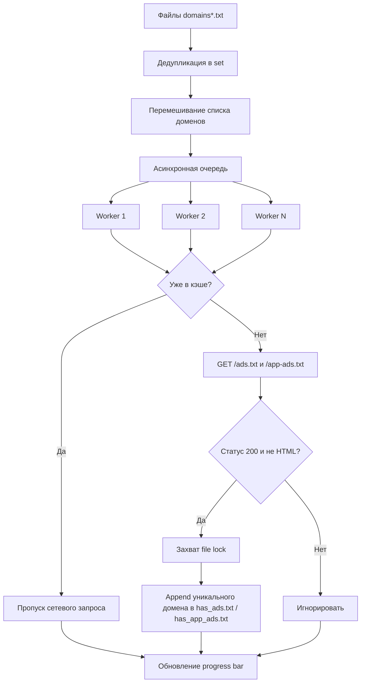

# Асинхронный проверщик Ads.txt и App-ads.txt

Высокопроизводительный асинхронный Python-краулер для проверки доступности `ads.txt` и `app-ads.txt` на больших массивах доменов.

[](https://www.python.org/)
[](https://docs.python.org/3/library/asyncio.html)
[](https://docs.aiohttp.org/)
[](LICENSE)

> [!NOTE]
> Проект реализован в виде асинхронного краулера-скрипта (а не пакетной Python-библиотеки) и оптимизирован для массовой проверки доменов с возможностью безопасного возобновления.

## Содержание

- [Асинхронный проверщик Ads.txt и App-ads.txt](#асинхронный-проверщик-adstxt-и-app-adstxt)
- [Содержание](#содержание)
- [Возможности](#возможности)
- [Технологический стек и архитектура](#технологический-стек-и-архитектура)
  - [Основной стек](#основной-стек)
  - [Структура проекта](#структура-проекта)
  - [Ключевые архитектурные решения](#ключевые-архитектурные-решения)
- [Быстрый старт](#быстрый-старт)
  - [Предварительные требования](#предварительные-требования)
  - [Установка](#установка)
- [Тестирование](#тестирование)
- [Развертывание](#развертывание)
- [Использование](#использование)
- [Конфигурация](#конфигурация)
- [Лицензия](#лицензия)
- [Контакты и поддержка сообщества](#контакты-и-поддержка-сообщества)

## Возможности

- Асинхронный HTTP-краулинг на базе `asyncio` + `aiohttp` с высокой параллельностью.
- Параллельная проверка двух endpoint-ов:
  - `https://<domain>/ads.txt`
  - `https://<domain>/app-ads.txt`
- Загрузка входных данных из нескольких файлов по маске `domains*.txt`.
- Автоматическая дедупликация между файлами через структуры `set` в памяти.
- Возобновляемый процесс с инкрементальной записью результатов в:
  - `has_ads.txt`
  - `has_app_ads.txt`
- Идемпотентная запись: ранее найденные домены повторно не добавляются.
- Случайная перестановка доменов для снижения последовательной нагрузки на одну инфраструктуру.
- Телеметрия прогресса через `tqdm` (progress bar по количеству доменов).
- Контроль времени ответа с жестким таймаутом (`TIMEOUT_SECONDS`).
- Поддержка редиректов (`allow_redirects=True`).
- Базовая валидация типа контента (`200 OK` и не `text/html`).
- Тихая обработка исключений для шумных сетевых ошибок (DNS/TLS/временные сбои).
- Исправление политики event loop для стабильной работы в Windows.

> [!IMPORTANT]
> Краулер намеренно подавляет многие предупреждения и сетевые исключения для максимальной производительности и чистого вывода в консоль. Для детальной диагностики используйте форк с явным логированием ошибок.

## Технологический стек и архитектура

### Основной стек

- **Язык:** Python `3.8+`
- **Асинхронный runtime:** `asyncio`
- **HTTP-клиент:** `aiohttp`
- **Индикатор прогресса CLI:** `tqdm`
- **Стандартные модули:** `glob`, `os`, `random`, `time`, `warnings`, `logging`, `sys`

### Структура проекта

```text
.
├── adstxtcrawler.py       # Основная реализация асинхронного краулера
├── README.md              # Документация на английском
├── README_ru.md           # Документация на русском
└── LICENSE                # Файл лицензии
```

### Ключевые архитектурные решения

- **Модель queue + worker:** Домены добавляются в `asyncio.Queue` и обрабатываются фиксированным количеством воркеров.
- **Запись под lock:** `asyncio.Lock` сериализует запись в выходные файлы и предотвращает race condition между воркерами.
- **Персистентный cache через файлы:** Уже найденные домены загружаются на старте и используются как кэш выполнения.
- **Сетевая стратегия best-effort:** Исключения подавляются, что делает решение ориентированным на throughput в условиях «шумного» интернета.

<details>
<summary>Mermaid: поток данных во время выполнения</summary>



</details>

## Быстрый старт

### Предварительные требования

- Python `3.8` или новее
- Доступ в сеть к целевым доменам (HTTPS/443)
- Входные файлы с именами по шаблону `domains*.txt`

> [!TIP]
> Используйте виртуальное окружение Python для изоляции зависимостей.

### Установка

```bash
git clone https://github.com/<your-org>/<your-repo>.git
cd AdVerify-adstxt-appadstxt-Crawler
python -m venv .venv
source .venv/bin/activate  # Linux/macOS
# .venv\Scripts\activate   # Windows PowerShell
pip install --upgrade pip
pip install aiohttp tqdm
```

Создайте один или несколько файлов с доменами:

```text
domains.txt
domains_batch_01.txt
domains_partners.txt
```

Каждый файл должен содержать один домен в строке (с протоколом или без него).

<details>
<summary>Диагностика проблем и альтернативные варианты установки</summary>

### Частые проблемы

- **`No files found matching the pattern domains*.txt`**
  - Убедитесь, что имя файла начинается с `domains` и заканчивается на `.txt`.
  - Проверьте, что запуск выполняется из корня репозитория.

- **Проблемы TLS/SSL**
  - Скрипт использует `ssl=False`, но на запросы может влиять промежуточная сетевая инфраструктура.
  - Проверьте ограничения firewall/proxy.

- **Медленная или нестабильная скорость обработки**
  - Уменьшите `CONCURRENCY_LIMIT` при перегрузке DNS/сети.
  - Подберите `TIMEOUT_SECONDS` под ваше окружение.

### Установка через локальный кеш wheel-файлов

```bash
pip download aiohttp tqdm -d ./vendor
pip install --no-index --find-links=./vendor aiohttp tqdm
```

</details>

## Тестирование

В репозитории пока нет отдельного unit/integration test набора. Базовые проверки:

```bash
python -m py_compile adstxtcrawler.py
python -m pip check
```

Рекомендуемые quality gates при дальнейшем развитии проекта:

```bash
python -m pytest -q
python -m ruff check .
python -m mypy adstxtcrawler.py
```

> [!WARNING]
> Для команд `pytest`, `ruff` и `mypy` нужно предварительно добавить эти инструменты и соответствующую конфигурацию в репозиторий.

## Развертывание

Для production-сценариев массового сканирования:

1. Упакуйте скрипт в воспроизводимое окружение (venv, контейнер или образ CI-раннера).
2. Подключайте большие батчи `domains*.txt` из object storage или artifact storage.
3. Сохраняйте `has_ads.txt` и `has_app_ads.txt` в постоянное хранилище между запусками.
4. Планируйте запуск через cron, GitHub Actions, GitLab CI, Jenkins или Kubernetes `CronJob`.

Минимальный пример Docker-образа:

```dockerfile
FROM python:3.11-slim
WORKDIR /app
COPY adstxtcrawler.py ./
RUN pip install --no-cache-dir aiohttp tqdm
CMD ["python", "adstxtcrawler.py"]
```

<details>
<summary>Шаблон CI/CD интеграции</summary>

### Рекомендуемые этапы пайплайна

- **Lint stage:** проверка синтаксиса и статический анализ
- **Package stage:** сборка runtime-образа
- **Scan stage:** запуск краулера с подключенными входными артефактами
- **Publish stage:** выгрузка `has_ads.txt` и `has_app_ads.txt`

### Операционные рекомендации

- Ротируйте `User-Agent`, если дефолтный отпечаток блокируется.
- Добавьте retry/backoff для временных сбоев, если важна полнота результатов.
- Отправляйте структурированные логи/метрики для контроля ошибок и скорости обхода.

</details>

## Использование

Запуск краулера из корня репозитория:

```bash
python adstxtcrawler.py
```

Базовая логика выполнения:

- Загружает и объединяет все `domains*.txt` файлы.
- Удаляет дубли и случайно перемешивает домены.
- Подгружает результаты прошлых запусков как cache.
- Асинхронно проверяет оба endpoint-а.
- Сразу добавляет новые найденные домены в выходные файлы.

Пример запуска через внешний Python-обёрточный скрипт:

```python
import subprocess

# Запускаем краулер дочерним процессом и выводим лог в консоль.
subprocess.run(["python", "adstxtcrawler.py"], check=True)
```

<details>
<summary>Расширенное использование: тюнинг производительности и надежности</summary>

### 1) Увеличение throughput для быстрых сетей

Измените константы в `adstxtcrawler.py`:

```python
CONCURRENCY_LIMIT = 100
TIMEOUT_SECONDS = 3
```

### 2) Консервативный режим для нестабильной сети

```python
CONCURRENCY_LIMIT = 20
TIMEOUT_SECONDS = 8
```

### 3) Пограничные случаи

- Домены с путями нормализуются до host-части.
- Префиксы `http://` и `https://` удаляются перед проверкой.
- Домен пропускается только если он уже есть **в обоих** выходных файлах.
- Ответ `200 OK` с `text/html` **не** считается валидным ads/app-ads файлом.

### 4) Постобработка результатов

После выполнения можно запустить нормализацию файлов:

```bash
sort -u has_ads.txt -o has_ads.txt
sort -u has_app_ads.txt -o has_app_ads.txt
```

</details>

## Конфигурация

Текущая конфигурация задается в исходном коде (`adstxtcrawler.py`).

- `OUTPUT_ADS`: имя файла для доменов с валидным `ads.txt`.
- `OUTPUT_APP_ADS`: имя файла для доменов с валидным `app-ads.txt`.
- `CONCURRENCY_LIMIT`: количество параллельных worker-задач.
- `TIMEOUT_SECONDS`: таймаут запроса на URL.
- `HEADERS`: HTTP-заголовки для `aiohttp.ClientSession`.

> [!CAUTION]
> Слишком высокий уровень параллелизма может перегружать DNS-резолверы, вызывать троттлинг со стороны удаленных ресурсов и нарушать сетевые политики.

<details>
<summary>Полная таблица параметров и предлагаемая env-схема</summary>

| Параметр | Тип | Значение по умолчанию | Область | Эффект |
|---|---|---:|---|---|
| `OUTPUT_ADS` | `str` | `has_ads.txt` | Runtime | Файл для добавления найденных доменов с `ads.txt` |
| `OUTPUT_APP_ADS` | `str` | `has_app_ads.txt` | Runtime | Файл для добавления найденных доменов с `app-ads.txt` |
| `CONCURRENCY_LIMIT` | `int` | `50` | Worker pool | Количество параллельных потребителей очереди |
| `TIMEOUT_SECONDS` | `int` | `5` | Network | Максимальное время ожидания ответа на запрос |
| `HEADERS[User-Agent]` | `str` | Chrome UA | HTTP layer | User-Agent для HTTP-запросов |

### Предлагаемая `.env` схема (будущее улучшение)

```dotenv
OUTPUT_ADS=has_ads.txt
OUTPUT_APP_ADS=has_app_ads.txt
CONCURRENCY_LIMIT=50
TIMEOUT_SECONDS=5
USER_AGENT=Mozilla/5.0 ...
```

### Предлагаемая JSON схема (будущее улучшение)

```json
{
  "output_ads": "has_ads.txt",
  "output_app_ads": "has_app_ads.txt",
  "concurrency_limit": 50,
  "timeout_seconds": 5,
  "user_agent": "Mozilla/5.0 ..."
}
```

</details>

## Лицензия

Проект распространяется под лицензией **MIT**. Подробности: [`LICENSE`](LICENSE).

## Контакты и поддержка сообщества

## Support the Project

[](https://www.patreon.com/OstinFCT)
[](https://ko-fi.com/fctostin)
[](https://boosty.to/ostinfct)
[](https://www.youtube.com/@FCT-Ostin)
[](https://t.me/FCTostin)

Если инструмент оказался полезен, поставьте звезду на GitHub или поддержите автора напрямую.
